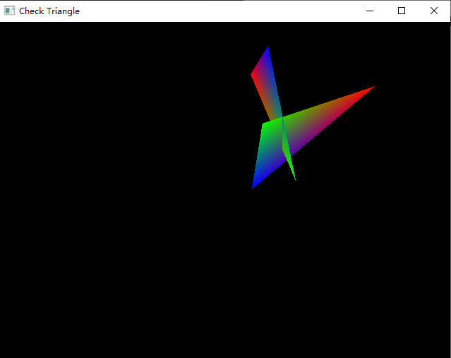

# triangleIntersectCheck
一种高效的判断两个三角形相交算法

vs2017以及以上版本直接打开工程文件即可

### CheckTriangleIntersect  
算法实现
### Test  
简单的性能测试用例，10000个三角形循环相交判断
### GLViewer  
一个简单的OpenGL可视化窗口，查看相交的结果  
按空格箭进行下次判断，ESC键退出  

